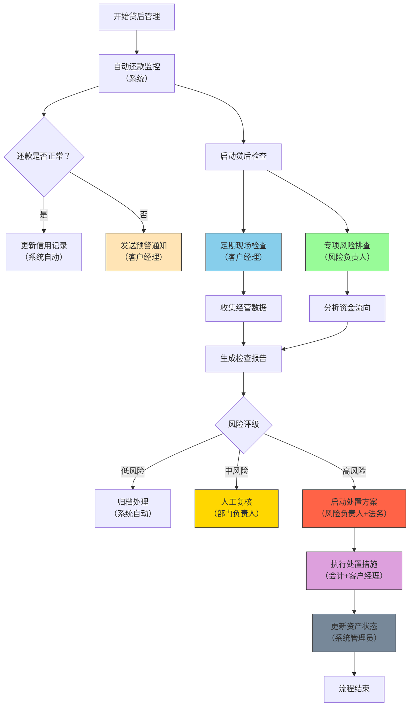

```mermaid
graph TD
    A[开始贷后管理] --> B[自动还款监控<br>（系统）]
    B --> C{还款是否正常？}
    C -->|是| D[更新信用记录<br>（系统自动）]
    C -->|否| E[发送预警通知<br>（客户经理）]
    
    B --> F[启动贷后检查]
    F --> G[定期现场检查<br>（客户经理）]
    F --> H[专项风险排查<br>（风险负责人）]
    
    G --> I[收集经营数据]
    H --> J[分析资金流向]
    
    I & J --> K[生成检查报告]
    K --> L{风险评级}
    
    L -->|低风险| M[归档处理<br>（系统自动）]
    L -->|中风险| N[人工复核<br>（部门负责人）]
    L -->|高风险| O[启动处置方案<br>（风险负责人+法务）]
    
    O --> P[执行处置措施<br>（会计+客户经理）]
    P --> Q[更新资产状态<br>（系统管理员）]
    Q --> R[流程结束]
    
    style E fill:#FFE4B5,stroke:#333
    style G fill:#87CEEB,stroke:#333
    style H fill:#98FB98,stroke:#333
    style N fill:#FFD700,stroke:#333
    style O fill:#FF6347,stroke:#333
    style P fill:#DDA0DD,stroke:#333
    style Q fill:#778899,stroke:#333
```