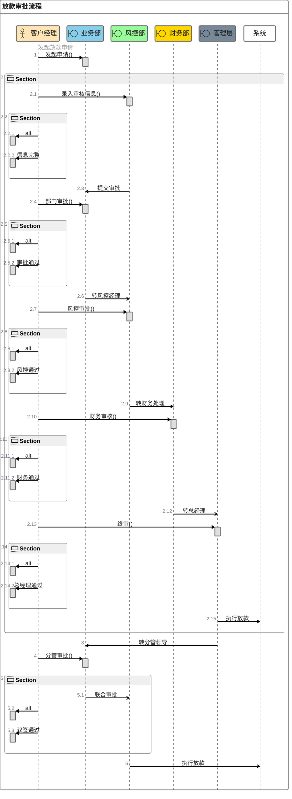

```mermaid
zenuml
    title 放款审批流程
    @Actor 客户经理 #FFE4B5
    @Boundary 业务部 #87CEEB
    @Boundary 风控部 #98FB98
    @Boundary 财务部 #FFD700
    @Boundary 管理层 #778899

    group 审批流程 {
        @Starter(客户经理)
        // 发起放款申请
  业务部.发起申请() {
    风控部.录入审核信息() {
      alt 信息完整？
        风控部 -> 业务部: 提交审批
        业务部.部门审批() {
          alt 审批通过？
            业务部 -> 风控部: 转风控经理
            风控部.风控审批() {
              alt 风控通过？
                风控部 -> 财务部: 转财务处理
                财务部.财务审核() {
                  alt 财务通过？
                    财务部 -> 管理层: 转总经理
                    管理层.终审() {
                      alt 总经理通过？
                        管理层 -> 系统: 执行放款
                      else
                        管理层 -> 业务部: 转分管领导
                        业务部.分管审批() {
                          业务部 -> 风控部: 联合审批
                          alt 双签通过？
                            风控部 -> 系统: 执行放款
                          else
                            风控部 -> 客户经理: 退回修改
                          }
                        }
                      }
                  else
                    财务部 -> 客户经理: 退回修改
                  }
                }
              else
                风控部 -> 客户经理: 退回修改
              }
            }
          else
            业务部 -> 客户经理: 退回修改
          }
        }
      else
        风控部 -> 客户经理: 补充材料
      }
    }
  }
}
```