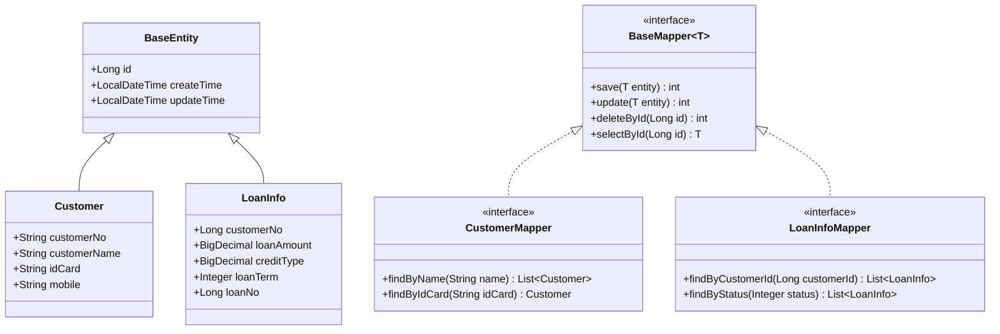

```mermaid
classDiagram
    class BaseEntity {
        +Long id
        +LocalDateTime  createTime
        +LocalDateTime  updateTime
    }
    
    class BaseMapper~T~ {
        <<interface>>
        +save(T entity) int
        +update(T entity) int
        +deleteById(Long id) int
        +selectById(Long id) T
    }
    
    class Customer {
        +String customerNo
        +String customerName
        +String idCard
        +String mobile
    }
    
    class LoanInfo {
        +Long customerNo
        +BigDecimal loanAmount
        +BigDecimal creditType
        +Integer loanTerm
        +Long loanNo
    }
    
    class CustomerMapper {
        <<interface>>
        +findByName(String name) List~Customer~
        +findByIdCard(String idCard) Customer
    }
    
    class LoanInfoMapper {
        <<interface>>
        +findByCustomerId(Long customerId) List~LoanInfo~
        +findByStatus(Integer status) List~LoanInfo~
    }
    
    BaseEntity <|-- Customer
    BaseEntity <|-- LoanInfo
    BaseMapper~BaseEntity~ <|.. CustomerMapper
    BaseMapper~BaseEntity~ <|.. LoanInfoMapper
```