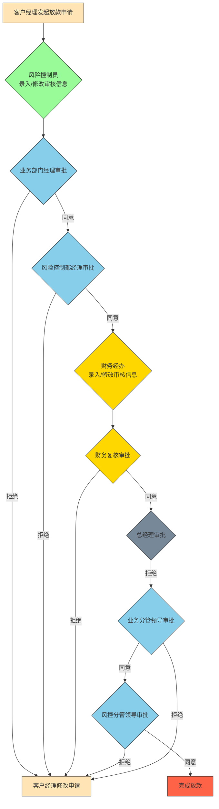

```mermaid
graph TD
    A[客户经理发起放款申请] --> B{风险控制员<br>录入/修改审核信息}
    B --> C{业务部门经理审批}
    C -->|拒绝| D[客户经理修改申请]
    C -->|同意| E{风险控制部经理审批}
    E -->|拒绝| D
    E -->|同意| F{财务经办<br>录入/修改审核信息}
    F --> G{财务复核审批}
    G -->|拒绝| D
    G -->|同意| H{总经理审批}
    H -->|拒绝| I{业务分管领导审批}
    I -->|同意| J{风控分管领导审批}
    J -->|同意| K[完成放款]
    J -->|拒绝| D
    I -->|拒绝| D
    
    style A fill:#FFE4B5,stroke:#333
    style B fill:#98FB98,stroke:#333
    style C fill:#87CEEB,stroke:#333
    style E fill:#87CEEB,stroke:#333
    style F fill:#FFD700,stroke:#333
    style G fill:#FFD700,stroke:#333
    style H fill:#778899,stroke:#333
    style I fill:#87CEEB,stroke:#333
    style J fill:#87CEEB,stroke:#333
    style K fill:#FF6347,stroke:#333

    classDef manager fill:#87CEEB,stroke:#333;
    classDef finance fill:#FFD700,stroke:#333;
    classDef risk fill:#98FB98,stroke:#333;
    classDef client fill:#FFE4B5,stroke:#333;
    classDef final fill:#FF6347,stroke:#333;

    class C,E,I,J manager;
    class F,G finance;
    class B risk;
    class A,D client;
    class K final;
```