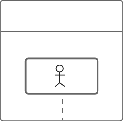

```mermaid
zenuml
   |业务部|
 客户经理 -> 系统: 发起放款申请
activate 客户经理

|风险控制部|
系统 -> 风险控制员: 录入/修改审核信息
activate 风险控制员
风险控制员 --> 系统: 提交审核信息
deactivate 风险控制员

|业务部|
系统 -> 业务部门经理: 审批请求
activate 业务部门经理
alt 拒绝
    业务部门经理 --> 客户经理: 退回修改
    deactivate 业务部门经理
    activate 客户经理
    客户经理 -> 系统: 重新提交申请
else 同意
    业务部门经理 --> 系统: 审批通过
    deactivate 业务部门经理

|风险控制部|
系统 -> 风险控制部经理: 审批请求
activate 风险控制部经理
alt 拒绝
    风险控制部经理 --> 客户经理: 退回修改
    deactivate 风险控制部经理
    activate 客户经理
    客户经理 -> 系统: 重新提交申请
else 同意
    风险控制部经理 --> 系统: 审批通过
    deactivate 风险控制部经理

|财务部|
系统 -> 财务经办: 录入/修改审核信息
activate 财务经办
财务经办 --> 系统: 提交财务数据
deactivate 财务经办

系统 -> 财务复核: 审批请求
activate 财务复核
alt 拒绝
    财务复核 --> 客户经理: 退回修改
    deactivate 财务复核
    activate 客户经理
    客户经理 -> 系统: 重新提交申请
else 同意
    财务复核 --> 系统: 审批通过
    deactivate 财务复核

|总经理|
系统 -> 总经理: 最终审批请求
activate 总经理
alt 拒绝
    |业务分管领导|
    总经理 --> 业务分管领导: 转交审批
    activate 业务分管领导
    |风控分管领导|
    业务分管领导 --> 风控分管领导: 联合审批
    activate 风控分管领导
    alt 同意
        风控分管领导 --> 系统: 审批通过
        deactivate 风控分管领导
        deactivate 业务分管领导
    else 拒绝
        风控分管领导 --> 客户经理: 退回修改
        deactivate 风控分管领导
        deactivate 业务分管领导
else 同意
    总经理 --> 系统: 审批通过
deactivate 总经理

|系统|
系统 -> 会计系统: 执行放款操作
activate 会计系统
会计系统 --> 系统: 放款完成
deactivate 会计系统

@enduml
```