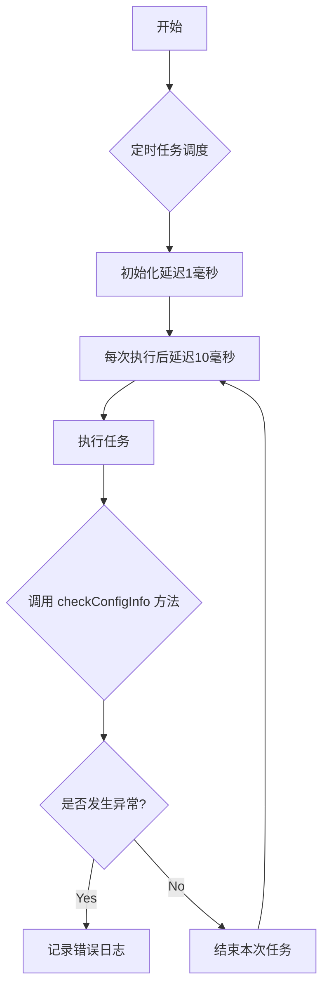

```mermaid
flowchart TD
    A[开始] --> B{定时任务调度}
    B --> C[初始化延迟1毫秒]
    C --> D[每次执行后延迟10毫秒]
    D --> E[执行任务]
    E --> F{调用 checkConfigInfo 方法}
    F --> G{是否发生异常?}
    G -->|Yes| H[记录错误日志]
    G -->|No| I[结束本次任务]
    I --> D

```